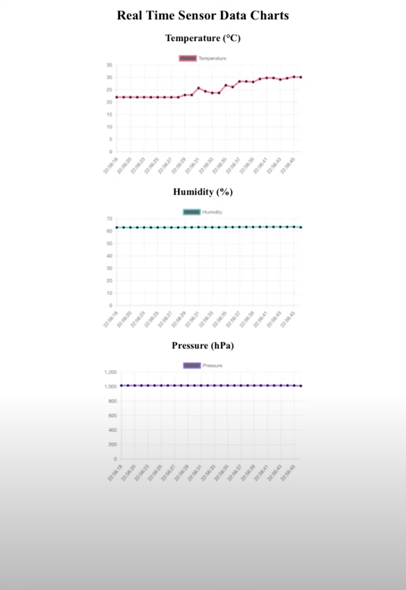

# ASE Final Project 
Real Time Visualization of BME280 Sensor Data using ESP32c3. Using ESP-IDF WIFI and Web Server to display sensor data in real time.

## Usage
1. Clone the repository
2. Modify the `main/wifi.h` file to include your wifi credentials (SSID and password)
3. Run the code on the ESP32c3 board
4. Look for the IP address, should be printed on the serial monitor 
    - Example: 
     `I (2104) esp_netif_handlers: sta ip: 10.0.1.14, mask: 255.255.255.0, gw: 10.0.1.1`
     
        `I (2104) wifi: Got IP: 10.0.1.14`
5. Open a web browser and navigate to the IP address `10.0.1.14/` (or whatever your IP address is)

## Demo Video
Click on the image below to watch the demo video on YouTube.

